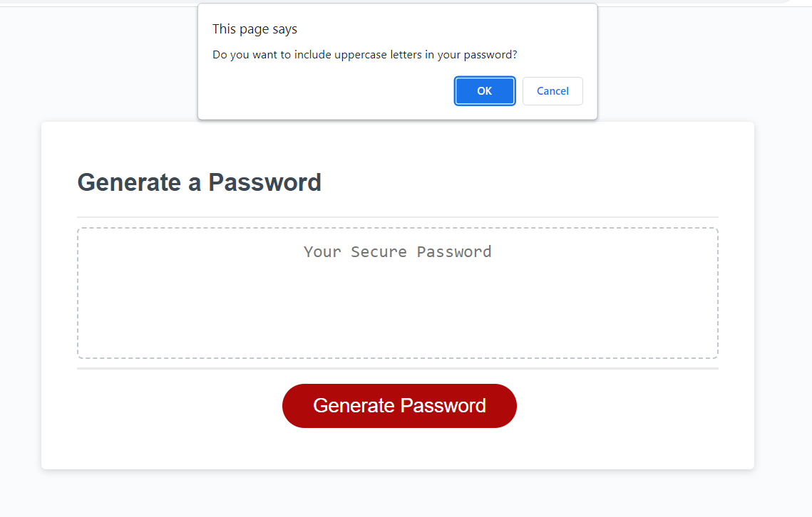
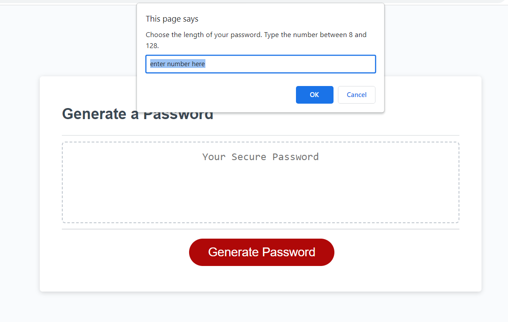
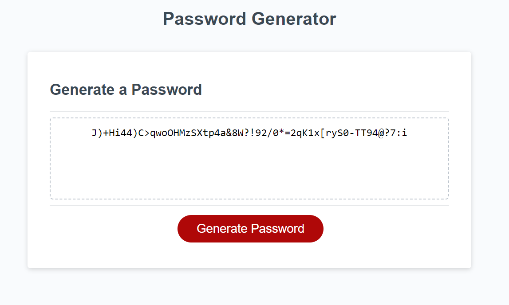

# Password Generator

## Description
An application that generates a password using user input.  
User is asked to choose the type of characters they want their password to contain from four different types: uppercase letters, lowercase letters, numbers and special characters.  
The user is also asked to choose the length of the password from 8 to 128 characters.  

This is the first project I wrote using JavaScript language. It required a lot of additional reading from me, but I also learned a lot.  
I'm glad I made something so useful.

## Instalation 
N/A

## Usage
To use the Password Generator you can click on the link below.

[Portfolio - Sonja Gorin](http://sonjagorin.github.io/Password-Generator)

Page preview:

## Credits
N/A

## License
Please refer to the LICENSE in the repo.
